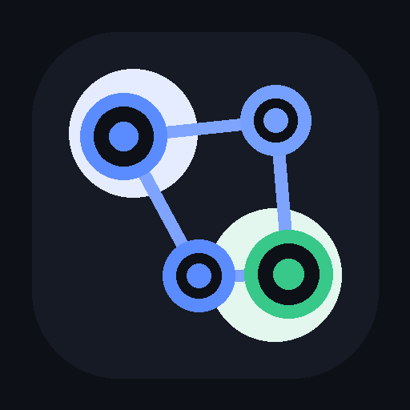
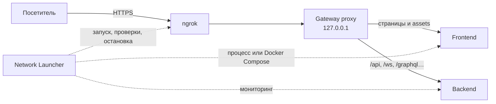

# Network Launcher



[](https://github.com/dartino21/network_launcher/actions/workflows/release.yml)
[](https://github.com/dartino21/network_launcher/releases/latest)
[](LICENSE)
[](pyproject.toml)
[](https://github.com/dartino21/network_launcher/releases/latest)

**Network Launcher** — настольное приложение, которое запускает локальный веб-проект и выдаёт временный публичный HTTPS-адрес через ngrok. Оно помогает показать незадеплоенный сайт заказчику, проверить его с телефона или поделиться текущей сборкой с командой.

[Скачать последнюю версию](https://github.com/dartino21/network_launcher/releases/latest) · [Начать работу](START_HERE.md) · [Архитектура](docs/ARCHITECTURE.md) · [Разработка](docs/DEVELOPMENT.md) · [Решение проблем](docs/TROUBLESHOOTING.md)

## Зачем нужен проект

Обычный dev-сервер доступен только на компьютере разработчика. Network Launcher объединяет frontend и API за одним локальным reverse proxy, подключает к нему ngrok и проверяет ссылку до того, как показать её пользователю.

Приложение умеет:

- распознавать статические сайты, Node.js, Flask и Docker Compose;
- направлять страницы во frontend, а настраиваемые пути вроде `/api` и `/ws` — в backend;
- проксировать HTTP, потоковые ответы/SSE и WebSocket;
- работать с HMR-соединениями Vite, Next.js и Webpack в режиме совместимости;
- находить опубликованные Docker-порты и проверять состояние сервисов;
- хранить отдельный профиль публикации для каждой папки проекта;
- показывать локальное превью, логи, текущих посетителей и график сессии;
- экспортировать HTML-отчёт о сессии;
- останавливать созданные процессы, proxy, туннель и Docker Compose из одного окна.

## Как устроена публикация



Исходники сайта не загружаются в отдельное хранилище: проект продолжает выполняться на вашем компьютере, а ngrok передаёт к нему входящие запросы. Подробности и границы компонентов описаны в [документе об архитектуре](docs/ARCHITECTURE.md).

## Быстрый старт для пользователя

Основная поддерживаемая платформа готовой сборки — **Windows 10/11 x64**.

1. Откройте [последний релиз](https://github.com/dartino21/network_launcher/releases/latest) и скачайте `NetworkLauncher-v<версия>-windows-x64.zip`.
2. Полностью распакуйте архив в обычную папку. Не запускайте EXE прямо из ZIP.
3. Откройте `NetworkLauncher.exe`.
4. На вкладке **Настройки** получите [ngrok authtoken](https://dashboard.ngrok.com/get-started/your-authtoken), вставьте его в скрытое поле и нажмите **Сохранить токен**.
5. На вкладке **Обзор** нажмите **Выбрать папку** и укажите корень веб-проекта.
6. Нажмите **Запустить проект** и дождитесь статуса **Работает**.
7. Скопируйте или откройте появившийся публичный URL.

Публичная ссылка работает, пока запущены Network Launcher, ваш проект и ngrok. При первом запуске защитник Windows может показать предупреждение для неподписанного приложения; сверяйте источник загрузки и используйте архив только из Releases этого репозитория.

## Поддерживаемые проекты

Тип определяется по файлам в корне выбранной папки. При наличии Compose-файла Docker имеет приоритет.

| Маркер | Режим запуска | Что должно быть установлено |
| --- | --- | --- |
| `docker-compose.yml`, `docker-compose.yaml`, `compose.yml`, `compose.yaml` | `docker compose up -d`, автоопределение frontend/backend и опубликованных портов | Docker Desktop с Compose |
| `index.html` | Встроенный многопоточный static/SPA-сервер | Ничего дополнительного |
| `package.json` | `npm start`; если уже есть `build/` — `npx serve -s build` | Node.js LTS и npm |
| `app.py` | Запуск Flask через Python проекта | Python и Flask, желательно в `.venv` |

Выбирайте папку проекта, а не отдельный файл. Для проектов другого типа можно сначала запустить сервер самостоятельно, а затем указать его порт в профиле; полноценный пользовательский сценарий для произвольной команды пока не реализован.

## Frontend + API

Для одного публичного домена укажите frontend и backend в **Настройки → Профиль публикации**. По умолчанию proxy направляет в backend пути:

```text
/api, /health, /ws, /socket.io, /graphql
```

В браузерном коде используйте относительные URL, например `fetch('/api/products')`. Адрес `http://localhost:5000` у внешнего посетителя указывает на его компьютер, а не на ваш backend. Перед запуском Network Launcher ищет такие loopback-адреса в клиентских файлах и выводит предупреждения в журнал.

## Настройки и локальные данные

- **Порт** — предпочтительный порт frontend; если он занят, приложение ищет свободный.
- **Frontend / Backend** — `auto`, номер порта или имя Docker-сервиса; `none` отключает backend.
- **Backend-пути** — префиксы, которые proxy отправляет в API.
- **Dev/HMR** — совместимость с origin/host-проверками dev-серверов.
- **Host upstream** — сохранять публичный `Host` или подменять его на локальный.
- **Переменные public URL** — переменные окружения, в которые передаётся публичный адрес, например `NEXTAUTH_URL` и `AUTH_URL`.

Рядом с EXE автоматически создаётся `data/`: в `data/config.json` находятся общие настройки и профили проектов, а в `data/logs/app.log` — журнал приложения. Эти локальные данные исключены из Git.

### Работа с секретами

Network Launcher передаёт authtoken официальной команде `ngrok config add-authtoken`. Токен хранится в стандартной конфигурации ngrok или может быть передан через `NGROK_AUTHTOKEN`; он не записывается в `data/config.json` и не добавляется в журнал приложения.

Публичный туннель делает выбранное приложение доступным из интернета. Не публикуйте проекты с тестовыми паролями, административными панелями или приватными данными без собственной авторизации. Остановите сессию сразу после демонстрации.

## Запуск из исходников

Понадобятся Windows, Git и Python 3.10–3.12 (в CI используется Python 3.12). Дополнительные инструменты нужны только для проектов соответствующего типа.

```powershell
git clone https://github.com/dartino21/network_launcher.git
cd network_launcher
py -3.12 -m venv .venv
.\.venv\Scripts\Activate.ps1
python -m pip install --upgrade pip
python -m pip install -r requirements.txt pytest
.\scripts\run_dev.ps1
```

После установки зависимостей приложение также можно открывать через `RUN_APP.bat`.

## Разработка и проверки

```powershell
$env:PYTHONPATH = "src"
python -m network_launcher
python -m pytest -p no:cacheprovider
```

Текущий набор содержит **39 автоматических тестов**: proxy и WebSocket, static/SPA-сервер, профили и миграцию конфигурации, Docker-разбор, диагностику запуска, ngrok и GUI smoke-сценарии. GitHub Actions запускает их на каждом push/PR и перед сборкой релиза.

Локальная Windows-сборка:

```powershell
powershell -ExecutionPolicy Bypass -File scripts\build_windows.ps1
```

Скрипт устанавливает зависимости, запускает тесты, собирает one-file EXE через PyInstaller и создаёт архив `release/NetworkLauncher-v<версия>-windows-x64.zip`. Полная инструкция находится в [руководстве разработчика](docs/DEVELOPMENT.md).

## Инженерные особенности

- GUI на PyQt5 выполняет сетевой и процессный запуск в фоновых потоках, не блокируя окно.
- Async reverse proxy на `aiohttp` потоково передаёт тело ответа и двунаправленно ретранслирует WebSocket.
- Публичный URL появляется только после локальной и внешней HTTP-проверки; частично запущенная сессия автоматически очищается.
- Дочерние процессы запускаются без лишних консольных окон и завершаются вместе с деревом процессов.
- Runtime override для Docker создаётся вне пользовательского проекта и удаляется при остановке.
- Версия проверяется по Git-тегу, а Windows-архив публикуется GitHub Actions только после успешных тестов.

## Документация

- [START_HERE.md](START_HERE.md) — короткий маршрут для пользователя, разработчика и ревьюера.
- [docs/ARCHITECTURE.md](docs/ARCHITECTURE.md) — компоненты, запуск, маршрутизация и решения по безопасности.
- [docs/DEVELOPMENT.md](docs/DEVELOPMENT.md) — окружение, тесты, ручной smoke-тест и сборка.
- [docs/TROUBLESHOOTING.md](docs/TROUBLESHOOTING.md) — диагностика частых проблем.
- [docs/RELEASING.md](docs/RELEASING.md) — выпуск новой версии.

## Структура репозитория

```text
network_launcher/
├── src/network_launcher/   # приложение и доменная логика
├── tests/                  # автоматические и ручные smoke-проверки
├── scripts/                # dev-запуск, PyInstaller и сборка релиза
├── assets/                 # иконка и графические ресурсы
├── docs/                   # техническая документация
└── .github/workflows/      # CI и публикация Windows-релиза
```

## Лицензия

Проект распространяется по лицензии [MIT](LICENSE).
