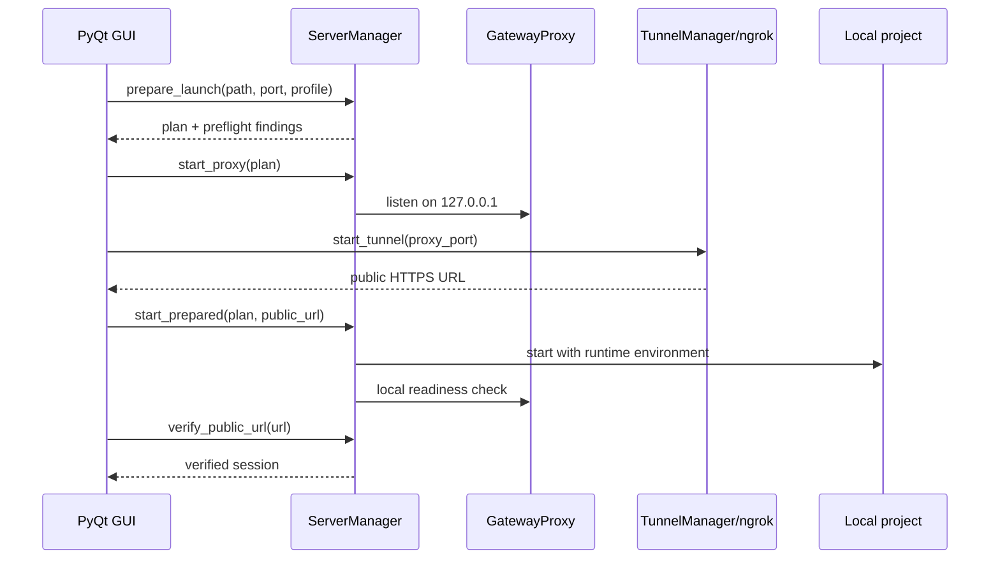

# Архитектура Network Launcher

## Назначение и границы

Network Launcher управляет одной локальной публикационной сессией: распознаёт веб-проект, запускает его, создаёт единый loopback proxy, подключает ngrok, проверяет доступность и отображает состояние в PyQt5 GUI.

Приложение не является хостингом, production reverse proxy или системой авторизации. Оно рассчитано на короткие демонстрационные и тестовые сессии с локального компьютера.

## Компоненты

| Модуль | Ответственность |
| --- | --- |
| `gui.py` | Окно, фоновые `QThread` workers, состояние кнопок, логи, превью и координация запуска |
| `server_manager.py` | Определение типа проекта, preflight, порты, запуск/готовность/остановка локальных процессов |
| `gateway_proxy.py` | Async HTTP/SSE/WebSocket reverse proxy на loopback-интерфейсе |
| `tunnel_manager.py` | Жизненный цикл ngrok, Agent API, проверка и сохранение authtoken |
| `ngrok_bundle.py` | Поиск bundled/local ngrok и загрузка официальной stable-сборки при необходимости |
| `docker_manager.py` | Разбор Compose, определение ролей/портов, runtime override и управление сервисами |
| `publish_profile.py` | Профиль проекта, нормализация настроек, миграция и поиск browser-side loopback URL |
| `spa_server.py` | Встроенный static-сервер с SPA fallback и корректными 404 для отсутствующих assets |
| `stats_collector.py` | Сессионная статистика из локального ngrok Agent API и HTML-отчёт |
| `config.py` | Путь к writable data, чтение и запись `config.json` |
| `process_utils.py` | Единые параметры скрытого запуска дочерних процессов на Windows |

## Жизненный цикл запуска

`StartWorker` выполняет медленные операции в фоновом потоке, чтобы GUI оставался отзывчивым.

Порядок «proxy → tunnel → приложение» выбран намеренно: публичный URL уже известен до запуска проекта и может быть передан в `NEXTAUTH_URL`, `AUTH_URL` и другие переменные профиля. При ошибке на любом этапе уже созданные части сессии останавливаются.

## Распознавание и запуск проекта

Приоритет определения типа:

1. любой поддерживаемый Compose-файл;
2. `index.html`;
3. `package.json`;
4. `app.py`;
5. неизвестный тип — запуск блокируется с диагностикой.

Для Node.js проверяется наличие npm; при необходимости выполняется установка зависимостей. Для Flask сначала ищется `.venv`, `venv` или `env` выбранного проекта, затем системный Python. Для Docker проверяются CLI, Compose и доступность daemon.

Состояние «готов» означает HTTP-ответ `2xx`/`3xx`, `401` или `403`. Постоянный `404`, отсутствие соединения и таймаут считаются ошибкой запуска.

## Маршрутизация

Gateway слушает только `127.0.0.1` и становится единственной целью ngrok. Целевой upstream выбирается по пути:

- запросы с backend-префиксом идут на backend-порт;
- остальные запросы идут на frontend-порт;
- если backend не задан, весь трафик направляется во frontend.

Proxy удаляет hop-by-hop заголовки, формирует `X-Forwarded-*`, при необходимости переписывает `Location` и cookie domain, потоково передаёт ответы и поддерживает двунаправленный WebSocket relay. Dev/HMR-режим корректирует `Origin` и `Host` для серверов, которые отклоняют публичный домен.

Если в Docker Compose уже найден gateway-сервис (например, Traefik или Caddy), он используется как frontend upstream, но локальный GatewayProxy всё равно остаётся внешней точкой входа.

## Конфигурация и runtime-данные

`data/config.json` имеет `config_version: 2` и содержит:

- последнюю папку и предпочтительный порт;
- флаг автозапуска;
- профили, индексированные нормализованным абсолютным путём проекта.

Публичный URL передаётся дочернему процессу только во время сессии через выбранные переменные и всегда через `NETWORK_LAUNCHER_PUBLIC_URL`. Для Compose создаётся временный override вне папки пользовательского проекта; при остановке он удаляется.

## Безопасность

- ngrok authtoken сохраняется официальным CLI в стандартном конфигурационном файле ngrok или читается из `NGROK_AUTHTOKEN`;
- значение токена не попадает в `data/config.json`, GUI-лог или возвращаемый результат операции;
- дочерние серверы и GatewayProxy используют loopback, но выбранное приложение становится публичным через туннель;
- preflight сканирует клиентские исходники на `localhost`/`127.0.0.1`, пропуская зависимости и build-каталоги;
- перед показом URL проверяются локальный proxy и публичный адрес;
- остановка завершает дерево локального процесса, ngrok и запущенные Compose-сервисы.

Граница доверия проходит по содержимому публикуемого проекта: Network Launcher не добавляет аутентификацию и не фильтрует бизнес-данные приложения.

## Наблюдаемость

События отображаются на вкладке **Логи** и пишутся в `data/logs/app.log`. Для Compose доступен отдельный просмотр Docker-логов. Статистика посетителей берётся из Agent API ngrok на `127.0.0.1:4040`; уникальность оценивается по IP в рамках текущей сессии, а «сейчас» — по пятиминутному окну.

## Тестовая стратегия

Текущий набор из 39 тестов покрывает:

- HTTP-методы, multipart, redirect/cookie rewrite и WebSocket proxy;
- static assets, SPA fallback, 404 и освобождение порта;
- профили, миграцию конфигурации и preflight;
- Compose-разбор и временный runtime override;
- ngrok Agent API, auth status и безопасную обработку секрета;
- проверки готовности и диагностические сообщения;
- GUI smoke-состояния и неблокирующий сбор runtime-статуса;
- скрытые процессы и поведение windowed PyInstaller-сборки.

Реальные внешние сервисы заменяются mock/stub-объектами; отдельный ручной сценарий `tests/manual_publish_smoke.py` проверяет полный локальный запуск с настоящим ngrok.
